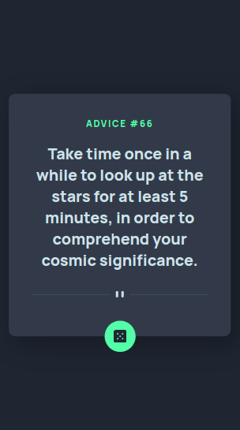

# Frontend Mentor - Advice generator app solution

This is a solution to the [Advice generator app challenge on Frontend Mentor](https://www.frontendmentor.io/challenges/advice-generator-app-QdUG-13db). Frontend Mentor challenges help you improve your coding skills by building realistic projects.

## Table of contents

- [Frontend Mentor - Advice generator app solution](#frontend-mentor---advice-generator-app-solution)
  - [Table of contents](#table-of-contents)
  - [Overview](#overview)
    - [The challenge](#the-challenge)
    - [Screenshots](#screenshots)
    - [Links](#links)
  - [My process](#my-process)
    - [Built with](#built-with)
    - [What I learned](#what-i-learned)
  - [Author](#author)

## Overview

### The challenge

Users should be able to:

- To generate random quotes using the die button

### Screenshots




### Links

- Solution URL: [FE Mentor Solution](https://www.frontendmentor.io/solutions/advice-generator-using-api-ByISQZfmq)
- Live Site URL: [Demo](https://fluffy-druid-408ab8.netlify.app)

## My process

1. Create HTML structure
2. Design with SCSS
3. Create the functions with JS

### Built with

- Semantic HTML5 markup
- CSS custom properties
- Flexbox
- [Sass](https://sass-lang.com/)

### What I learned

I had an refresher on how vanilla JS works since I always worked with frameworks.

```js
const getAdvice = (num) => {
    const url = `https://api.adviceslip.com/advice/${num}`;
    fetch(url)
    .then(function (response) {
      return response.json();
    })
    .then(function (data) {
      console.log(data);
      document.getElementById("no").innerHTML = data.slip.id
      document.getElementById("advice").innerHTML = data.slip.advice
    })
    .catch(function () {
      console.log("Booo");
    });
}
```

## Author

- Website - [Jay Anton Roblico](https://jayantonroblico.tech/)
- Frontend Mentor - [@saerdyey](https://www.frontendmentor.io/profile/saerdyey)
